# Ernie Terminal

本课程设计主要内容为：
录音上传至服务器，调用百度短语音识别及ERNIE大模型获取对话，下载本地播报。

## 技术分析

项目使用到的技术比较少且较为基础，主控选择的是STM32H750VBT6，虽然使用如ESP32能很简单实现本项目，
但还是选用了STM32来进行尝试。
技术主要有“录音”，“联网”，“API调用”，“本地播报”四方面。

### 录音

录音功能主要为使用STM32的ADC外设。具体方案为使用MAX9814模块获取音频时域信号，
STM32使用定时器触发ADC获取采样频率16K、深度16位、单通道的音频数字信号，通过DMA将数据搬移至指定数组中。（完善可改为存储至SD卡中）

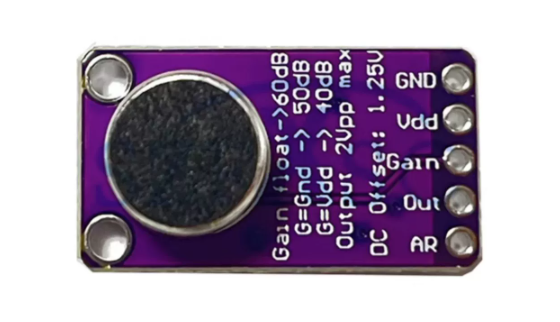{width=50% height=duto}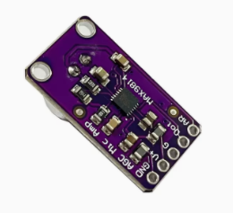{width=40% height=duto}
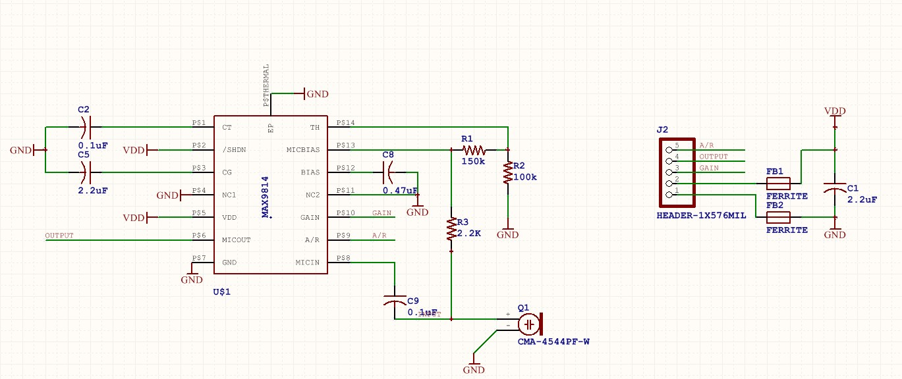{width=100% height=duto}

### 联网

使用ESP01S+手机热点的方式实现联网。系统上电后会对ESP01S进行初始化并连接wifi和TCP服务器。（另一方案是使用有人物联的WH-LTE-7S1模块）

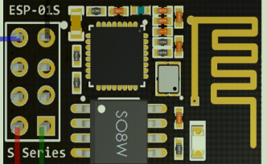
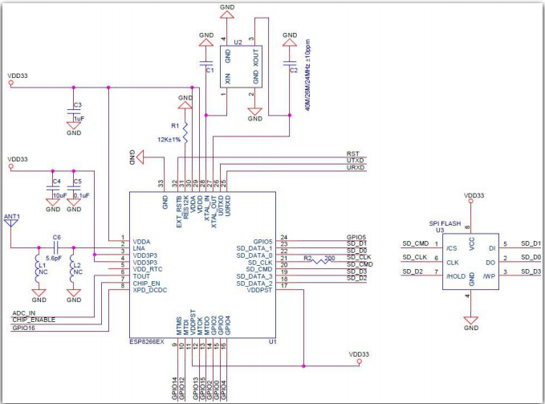

### API调用

因为使用的串口ESP01S模块用于联网，模块自身固件有TCP连接指令，于是在云服务器搭建TCP服务，用于收发数据。c语言搭建TCP服务，python脚本简单处理数据后调用API。

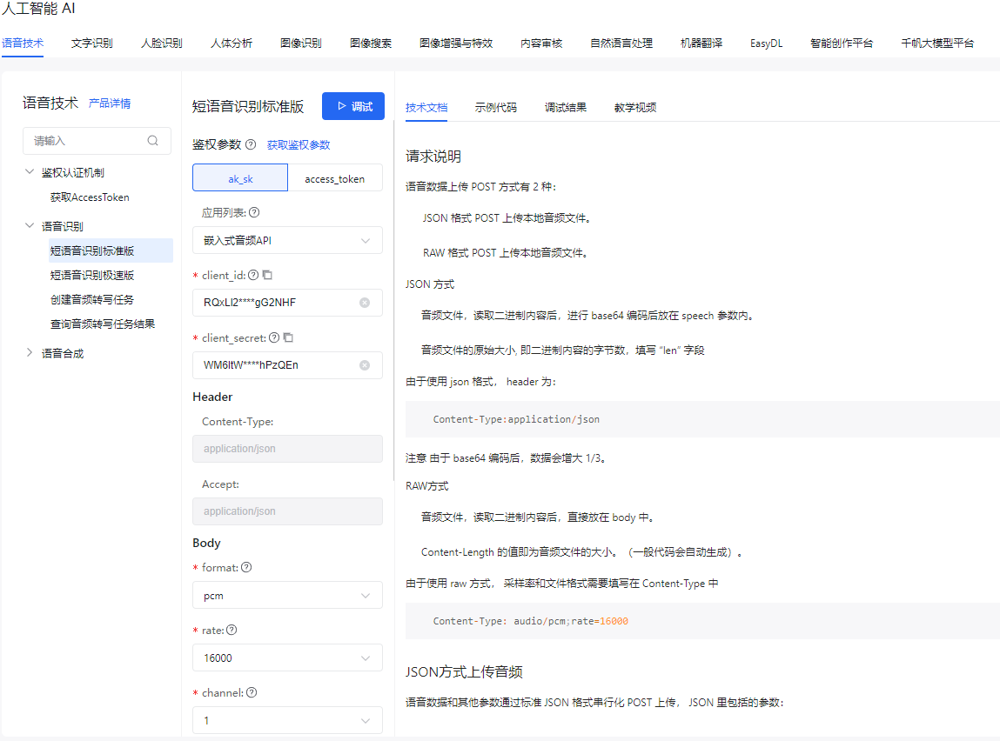{width=80% height=auto}
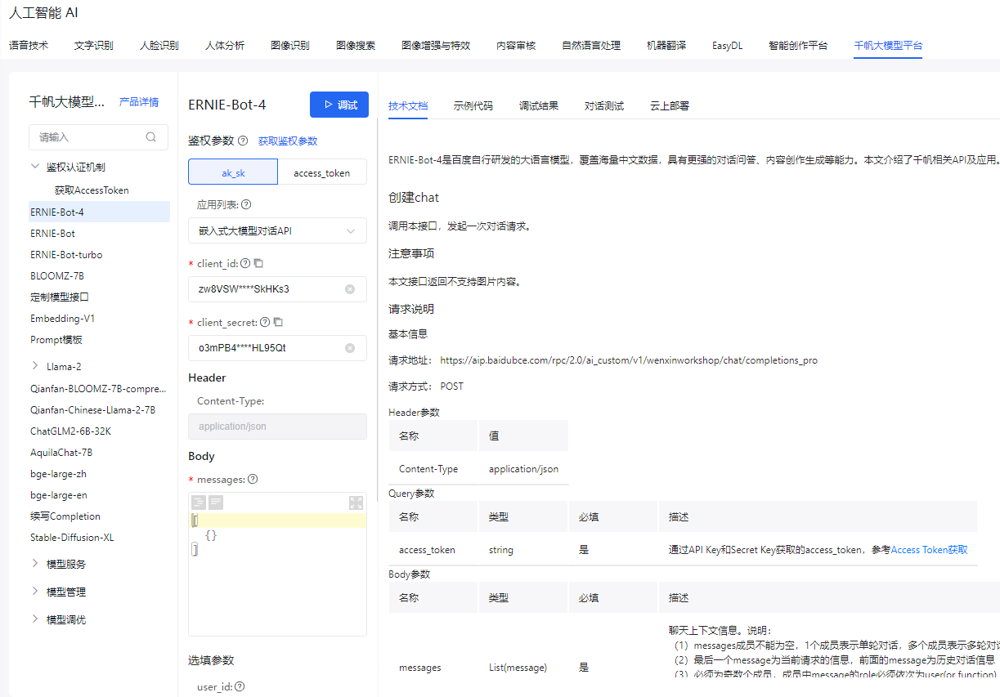{width=80% height=auto}

### 本地播报

使用SYN6288模块播报对话。（可再调用一次短语音合成API，交由STM32使用I2S控制PCM5102模块播放，该功能仅用香橙派做了验证）

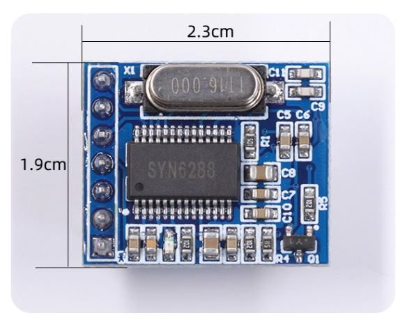
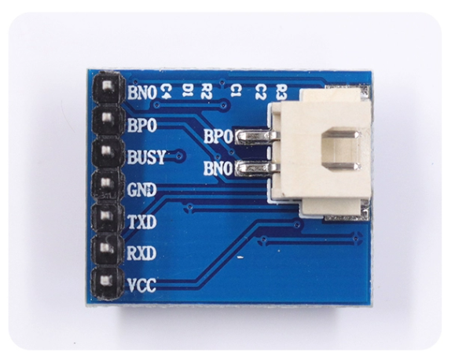

## 引脚分配

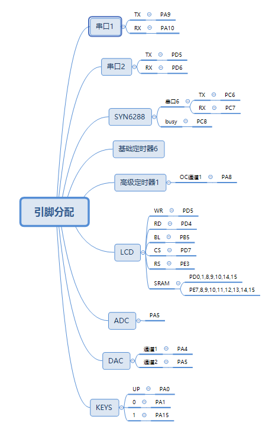

## 实物展示

### TCP服务器

运行状态图
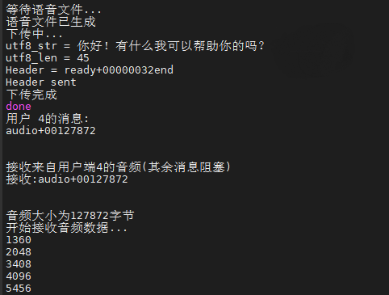
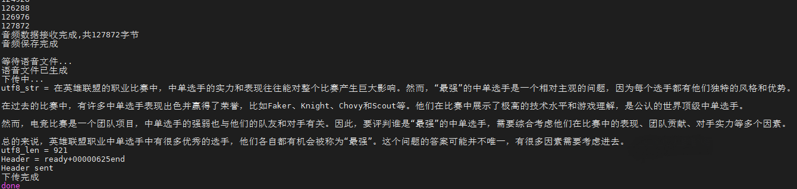{width=150% height=auto}

### API调用脚本

运行状态图
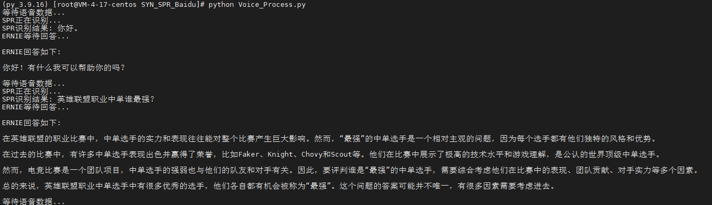{width=150% height=auto}

待定
